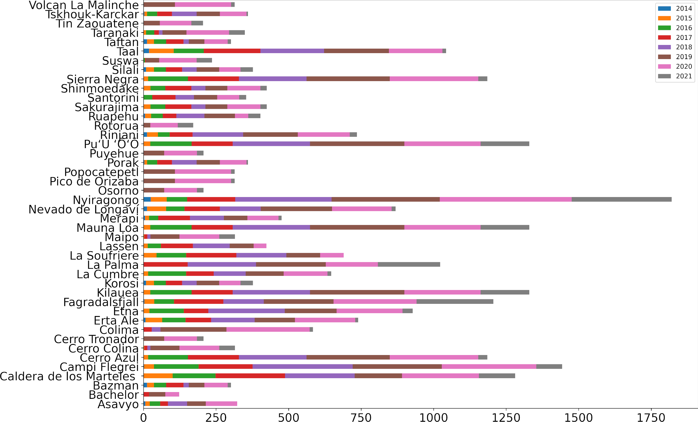

# Hephaestus Dataset

Work in progress.

This repository contains the data and code used in [Hephaestus: A large scale multitask dataset towards InSAR understanding](https://arxiv.org/abs/2204.09435)

If you use this work, please cite:
```
@misc{https://doi.org/10.48550/arxiv.2204.09435,
  doi = {10.48550/ARXIV.2204.09435},
  url = {https://arxiv.org/abs/2204.09435}, 
  author = {Bountos, Nikolaos Ioannis and Papoutsis, Ioannis and Michail, Dimitrios and Karavias, Andreas and Elias, Panagiotis and Parcharidis, Isaak}  
  keywords = {Computer Vision and Pattern Recognition (cs.CV), Instrumentation and Methods for Astrophysics (astro-ph.IM), Machine Learning (cs.LG), FOS: Computer and information sciences, FOS: Computer and information sciences, FOS: Physical sciences, FOS: Physical sciences},
  title = {Hephaestus: A large scale multitask dataset towards InSAR understanding},
  publisher = {arXiv}, 
  year = {2022}, 
  copyright = {arXiv.org perpetual, non-exclusive license}
}

```


### Dataset and pretrained models

The annotation files can be downloaded [here](https://www.dropbox.com/s/i08mz5514gczksz/annotations_hephaestus.zip?dl=0).

The raw InSAR data can be found [here](dropboxlink).

The dataset is organized in the following structure:
```
|- FrameID (e.g 124D_05291_081406)
|    |-- interferograms
|    |    |---  Dates (e.g 20181128_20181204)
|    |    |    |--- InSAR.png
|    |    |    |--- Coherence.png
```

The cropped 224x224 patches, along with the respective masks and labels can be found [here](https://www.dropbox.com/s/2bkpj79jepk0vks/Hephaestus_Classification.zip?dl=0).

The directory structure for the cropped patches is:

```
|-- Root directory
|   |-- Class labels per patch id
|   |-- Masks
|   |-- Cropped patches
```

### Annotation

The dataset contains both labeled and unlabeled data. The labeled part covers 38 frames summing up to 19,919 annotated InSAR.
The list of the studied volcanoes, along with the temporal distribution of their samples can be seen below. 

Each labeled InSAR is accompanied by a json file containing the annotation details. Below we present an example of an annotation file. A detailed description can be seen in the original paper (section 2.2):
```python
{
  "uniqueID": 19912, #ID given to the annotation file.
  "frameID": "103A_07010_121313", #ID of the InSARs frame. This is a unique location identifier.
  "primary_date": "20210414", #Caption date of the primary SAR image.
  "secondary_date": "20210426", #Caption date of the secondary SAR image.
  "corrupted": 0, #Flag for corrupted InSAR.
  "processing_error": 0, #Error attributed to InSAR processing.
  "glacier_fringes": 0, #Flag to identify the existence of glaciers
  "orbital_fringes": 0, #Fringes attributed to orbital errors.
  "atmospheric_fringes": 2, #Fringes attributed to atmospheric effects. Its value ranges from 0 to 3 with 0 denoting is absense.
  "low_coherence": 0, #Flag to denote low coherence.
  "no_info": 0, #Flag to identify InSAR with very low information signal.
  "image_artifacts": 0, #Flag to identify InSAR with artificats unrelated to interferograms.
  "label": [ 
    "Non_Deformation" #Labels. May contain multiple elements.
  ],
  "activity_type": [], #Activity type of each ground deformation pattern.
  "intensity_level": "None", #Intensity of the event.
  "phase": "Rest", #Phase of the volcano. Rest/Unrest/Rebound.
  "confidence": 0.8, #Confidence of the annotator for this annotation.
  "segmentation_mask": [], #List of polygons containing the ground deformation patterns.
  "is_crowd": 0, #Flag to denote whether there are multiple ground deformation patterns in the InSAR.
  "caption": "Turbulent mixing effect or wave-like patterns caused by liquid and solid particles of the atmosphere can be detected around the area. No deformation activity can be detected."
}
```

### Annotation Processing

All the necessary utilities are contained in annotation_utils. One can directy load the annotation file or the segmentation mask(s) of the desired interferogram.

#### Segmentation mask example:

```
from annotation_utils import *

annotation = 'annotations/10478.json'
get_segmentation(annotation,verbose=True)

```

#### Reproduce cropped patches

If needed one can reproduce the cropped patches with the desired resolution using the save_crops utility.
```
save_crops(annotation_folder='YOUR_ANNOTATION_FOLDER/',save_path = 'OUTPUT_PATH',mask_path='PATH_TO_SAVE_MASKS')
```

The functions 
`crop_around_object(annotation_path,verbose=True,output_size=224,index=0)` and `image_tiling(image,tile_size=224)` handle the cropping of the interferograms. When the InSAR of interest contains ground deformation the function `crop_around_object` is called, otherwise the InSAR is split in non-overlapping patches with `image_tiling`. 

`crop_around_object` makes sure to include the deformation pattern in a random crop at the desired resolution without excluding the presence of multiple ground deformation types in the cropped patch.


